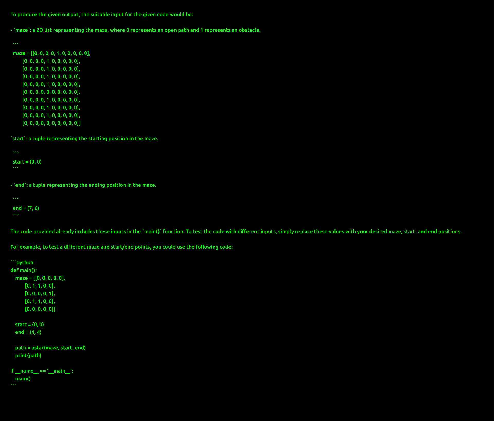

# Code Editor Web Application - Overview

This document provides a visual overview of the key components and functionalities of the Code Editor Web Application. The following screenshots illustrate different aspects of the user interface and features.

---

## Core Editor Interface

### Main Editor (White Theme)

*The primary code editing area with a light theme, providing a clean and focused environment for writing and editing code.*

### Main Editor (Black Theme)

*The main code editing area with a dark theme, offering an alternative visual preference for users.*

### Main Editor with Code and Function Highlighting

*This view demonstrates syntax highlighting for code readability and potential function highlighting for better code navigation.*

### Main Editor View

*A general view of the main editor interface, showcasing its layout and key elements.*

---

## Input and Output Areas

### Input Text Box Area

*The designated area where users can input text, such as code, prompts, or other relevant information.*

### Output Text Box Area

*The section where the application displays output, results, or responses based on the user's input or actions.*

### Input and Output Interaction

*This screenshot illustrates the typical flow of user input and the corresponding output generated by the application.*

---

## Functionality and Features

### AI Model Selection

*Allows users to choose from various AI models to power different functionalities within the editor.*

### AI Prompt Generation

*Demonstrates the interface for generating prompts that can be used with the selected AI models.*

### AI Model Interactions

*An overview of how different AI models are integrated and interact within the application.*

### Code Generation

*Illustrates the code generation capabilities, where the application can automatically generate code snippets based on user input or prompts.*

### Function Input

*Shows the specific input method or interface for interacting with functions within the editor.*

### Function Output

*Displays the output or results generated by executing functions within the editor.*

---

## User Interface Elements

### Code Editor Interface

*A focused view of the code editor component, highlighting its features and layout.*

### Color Selection Interface

*Presents a high-quality view of a color selection tool or interface within the application.*

### File Management Interface

*Illustrates the file management system, allowing users to organize, open, and save files.*

### Language Selection Dropdown

*Shows the dropdown menu or interface that enables users to select different programming languages.*

### Grok API Key Input

*The interface where users can input their Grok API key to enable integration with the Grok AI model.*

---

## Screenshots with Different Themes and Resolutions

### Full HD Black and White Screenshot (Input)

*A full HD resolution screenshot of an input area in black and white.*

### Full HD Color Screenshot (Input)

*A full HD resolution screenshot of an input area in color.*

### Full HD Black and White Screenshot (Output)

*A full HD resolution screenshot of an output area in black and white.*

### Full HD Color Screenshot (Output)

*A full HD resolution screenshot of an output area in color.*

---

## Shared Code Feature

### Shared Code (Dark Theme)

*An example of shared code displayed with a dark theme. Note: This is likely an HTML file, but it represents a visual aspect.*

### Shared Code (Light Theme)

*An example of shared code displayed with a light theme. Note: This is likely an HTML file, but it represents a visual aspect.*
