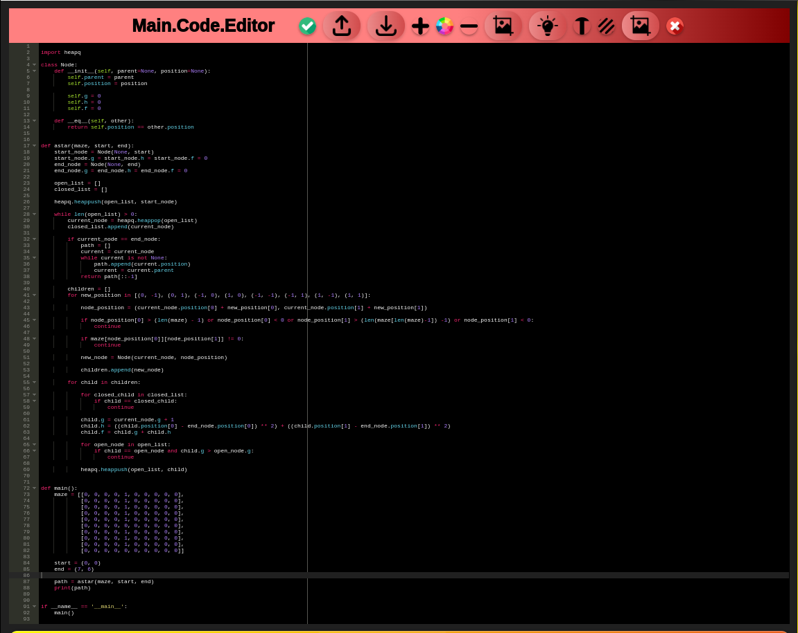

# 🚀 Code Editor Web Application - Feature Showcase 🌟

This document provides a comprehensive visual tour of the Code Editor Web Application's key features and user interface elements. Explore the screenshots below to understand the application's capabilities.

---

## 💻 Core Editing Experience

**1. Main Editor Themes:**

   **(a) Light Theme:**
   
   *A clean and intuitive coding environment with a light color scheme for focused development.*

   **(b) Dark Theme:**
   
   *An alternative dark theme, providing a comfortable visual experience for users who prefer it.*

   **(c) Enhanced Syntax Highlighting:**
   
   *Clear syntax highlighting improves code readability, with potential function highlighting for better navigation.*

   **(d) Integrated Editor View:**
   
   *A holistic view of the main editor interface, showcasing its layout and essential components.*

---

## 📤 Input & Output Management 📥

**2. Interactive Input/Output Areas:**

   **(a) Input Text Interface:**
   
   *A dedicated text area for users to input code, prompts, or instructions.*

   **(b) Output Display Area:**
   
   *The designated section for displaying application outputs, results, and feedback.*

   **(c) Seamless Interaction Flow:**
   
   *Illustrates the smooth process of providing input and receiving corresponding output within the application.*

---

## ✨ Intelligent Features Powered by AI ✨

**3. AI-Driven Capabilities:**

   **(a) Model Selection Hub:**
   
   *Empowering users to choose from a variety of AI models to enhance their coding workflow.*

   **(b) Smart Prompt Generation:**
   
   *An intuitive interface for crafting effective prompts to leverage the power of AI.*

   **(c) AI Model Integration:**
   
   *A visual representation of the seamless integration of different AI models within the editor.*

   **(d) Intelligent Code Generation:**
   
   *Demonstrates the ability of the application to generate code snippets based on user input or AI prompts.*

   **(e) Function Interaction - Input:**
   
   *The specific interface designed for providing input to functions within the editor.*

   **(f) Function Interaction - Output:**
   
   *Displays the results and output generated from the execution of functions.*

---

## ⚙️ Essential UI Components 🛠️

**4. Key Interface Elements:**

   **(a) Dedicated Code Editor:**
   
   *A focused view of the core code editing component with its inherent features.*

   **(b) High-Quality Color Palette:**
   
   *A detailed view of the color selection tools or interface, emphasizing visual quality.*

   **(c) Robust File Management System:**
   
   *Illustrates the application's file management capabilities for organizing and handling project files.*

   **(d) Language Selection Menu:**
   
   *A user-friendly dropdown menu for selecting different programming languages.*

   **(e) Grok API Integration:**
   
   *The interface for securely inputting the Grok API key to enable Grok AI model integration.*

---

## 🖼️ Theme & Resolution Showcase 🖥️

**5. Visual Variations:**

   **(a) Input Area (FHD, Black & White):**
   
   *A monochrome view of the input area at Full HD resolution.*

   **(b) Input Area (FHD, Color):**
   
   *The input area displayed in full color at Full HD resolution.*

   **(c) Output Area (FHD, Black & White):**
   
   *A monochrome representation of the output area in Full HD.*

   **(d) Output Area (FHD, Color):**
   
   *The output area shown in full color at Full HD resolution.*

---

## 🔗 Shared Code Snippets 🌐

**6. Collaborative Code Sharing:**

   **(a) Shared Code (Dark Theme):**
   
   *A snippet of shared code rendered with a dark theme.*

   **(b) Shared Code (Light Theme):**
   
   *A snippet of shared code presented with a light theme.*

---

This overview provides a detailed look at the Code Editor Web Application's interface and functionalities.
